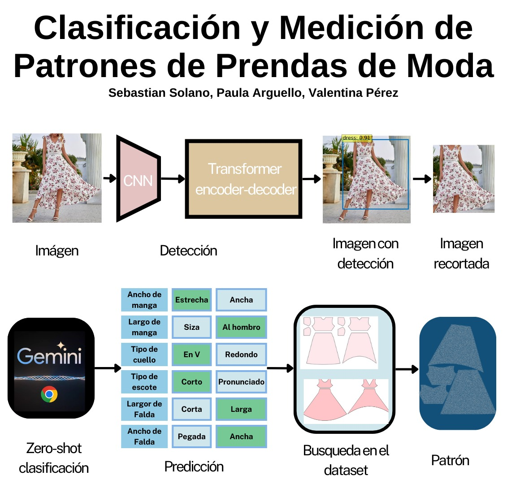

# Clasificación y Medición de Patrones de Prendas de Moda

  

    
  

    <a href="https://github.com/paularguello07" rel="external nofollow noopener" target="_blank"><strong>Paula Arguello</strong></a>
    ·
    <a href="https://github.com/valperz" rel="external nofollow noopener" target="_blank"><strong>Valentina Pérez</strong></a>
    ·
    <a href="https://github.com/stian1909" rel="external nofollow noopener" target="_blank"><strong>Sebastian Solano</strong></a>
    
  

## Descripción general

El proyecto "Clasificación y Medición de Patrones de Prendas de Moda" tiene como objetivo predecir el patrón y las características de un vestido a partir de una imagen, utilizando un dataset etiquetado con atributos específicos como el tipo y ancho de manga, el tipo y profundidad de escote, y las dimensiones de la falda. El proceso involucra la extracción de características mediante una CNN, seguida de una clasificación y predicción con un modelo Transformer y una técnica de Zero-shot. Finalmente, se busca el patrón correspondiente en el dataset, permitiendo automatizar la identificación y diseño de patrones en la industria de la moda.

## Estructura del código

- `dataset/`: En este directorio se almacenan todas las combinaciones de los diferentes vestidos con modelos en diferentes perspectivas, junto con las caracteristicas que los describen

- `detect.py`: Detecta los vestidos de una imagen dada

- `gemini.py`: Identifica las características del vestido que se reconoció en el archivo detect.py

- `testing.py`: Compara las imagenes de entrada con cada una de las combinaciones de dataset/

- `test_real_images.py`: Compara con imagenes del mundo real las combinaciones de dataset/ y con la medida en centrimetros de la cintura se hace una relación con los pixeles para hallar la medida de los patronajes

- `results.py`: Muestra la precisión de cada procesamiento de imagenes

Página del semillero: [Hands on computer vision](semillerocv.github.io)

